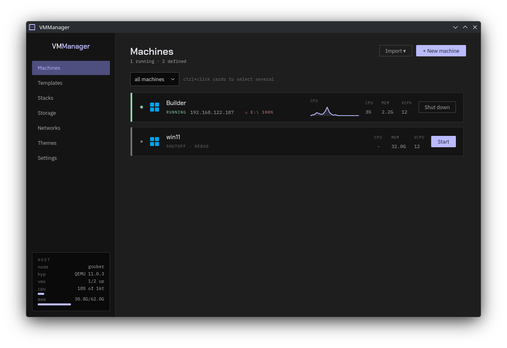
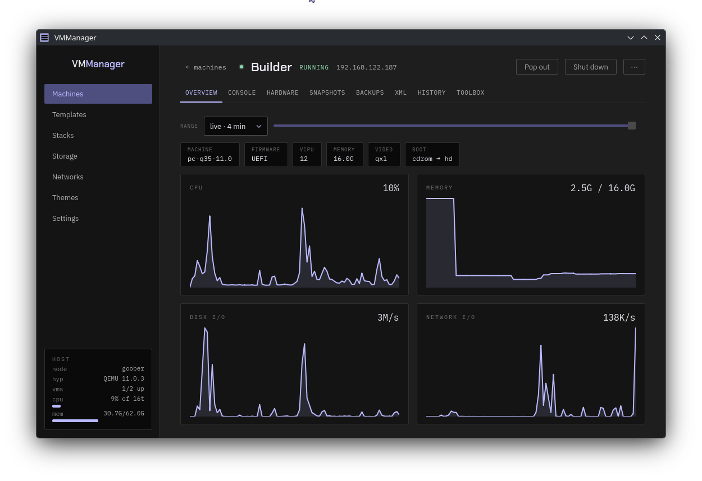
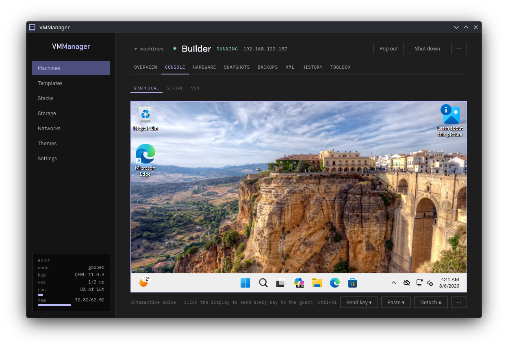
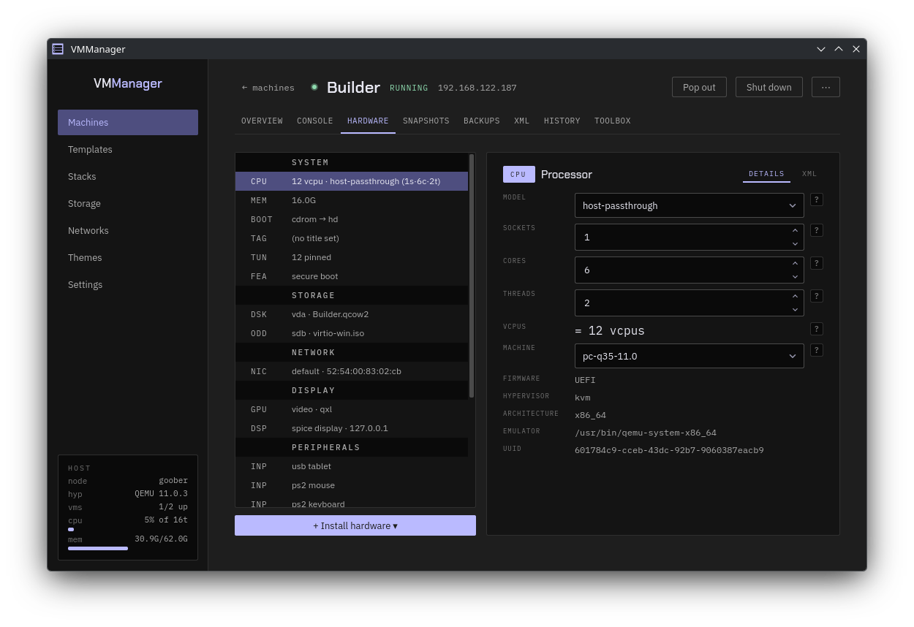
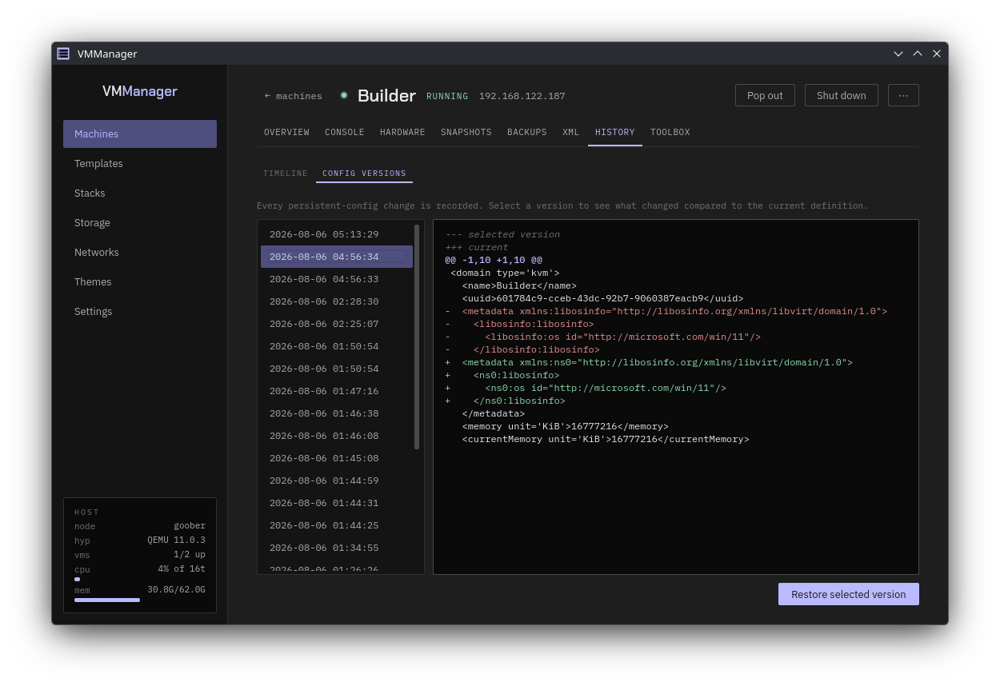

# VMManager

A desktop app for managing libvirt/QEMU virtual machines on Linux. Built to
replace virt-manager, and to do the things virt-manager leaves you doing by hand.

Machines are shown as wide rows with live usage graphs. The console is built in,
for both VNC and SPICE. Everything about a machine's hardware is editable, and
most of it while the machine runs.

```sh
git clone <this repository>
cd VmManager
./install.sh
```

See **[INSTALL.md](INSTALL.md)** for what it needs and the other ways to install
it, and **[FEATURES.md](FEATURES.md)** for what it can do.

## A look at it



Machines as rack bays. The strip down the left edge and the LED carry the state,
a running machine draws its own CPU graph, and the host's own load sits in the
corner of the sidebar. `SHUTOFF · DEBUG` is a machine with modes, showing which
one it is on, and `⚠ E:\ 100%` is the guest agent reporting a full disk inside
the running one.



What a machine is and what it is doing, on one screen. The graphs are live while
it runs, and the range picker goes back over recorded history rather than only
showing the last few minutes.



The console is in the app, for both VNC and SPICE - here a Windows guest over
SPICE, with the clipboard shared both ways. Click the display and the whole
keyboard goes to the guest until you press the release combination. Detach it
into its own window when you want it beside something else.



Every device on the machine, grouped. Right-click a row to take it off; the
panel on the right is the editor - the fields are the controls themselves, so
there is no Edit button to press first. Change one and Save and Discard appear,
and only what you changed gets written. The **?** beside a field explains it on
hover. Most of it applies while the machine is running.



Every change to a machine's definition is kept. Pick a version to see what
changed, and restore it if you want it back.

## A few things it does that virt-manager does not

- **Unattended Windows installs**, the counterpart to cloud-init - including
  the virtio driver Setup needs to see the disk at all.
- **Cloud images in the wizard.** Pick Debian, Ubuntu, AlmaLinux, Rocky or Arch;
  it downloads, verifies, imports and fills in the defaults.
- **Templates and linked clones.** Deploy a copy-on-write clone in under a
  second, and flatten it into a standalone disk later.
- **Modes.** A passthrough machine is really two machines - one with the graphics
  card handed over, one with a console to watch it boot. Save each as a named
  mode and switch between them safely.
- **Tuning that knows your host.** CPU pinning against the real core and thread
  layout read from libvirt, with the emulator parked out of the way.
- **Incremental backups** on libvirt checkpoints, copying only changed
  blocks - and restore of a whole chain back into a bootable machine.
- **Config history.** Every definition change kept, shown as a diff, restorable.
- **A window per machine**, so you can work on several at once.
- **Themes.** Colours, corner radii and fonts in a file you can edit in the app.
- **Guest features** people normally paste into raw XML: Hyper-V
  enlightenments, KVM hiding, Looking Glass, evdev passthrough, secure boot.
- **Passthrough diagnostics** that say why a device will or will not work -
  and the fixes: bind to vfio-pci now or at boot, dump and trim a card's
  video BIOS, the exact IOMMU kernel parameter for your host.
- **Single-GPU passthrough set up for you.** The libvirt hooks that stop your
  desktop, free the card and put it all back, generated for this host's
  display manager and driver - shown in full before they are written.
- **CPU isolation while a machine runs**, so the host stops scheduling its own
  work onto the cores the guest is pinned to.
- **Hardware you edit in place.** Every property of a device is a field on its
  faceplate - a disk's serial and discard mode, a display's listen address,
  port and password - rather than a reading you have to go to raw XML to
  change.

Plus a command palette, scheduled snapshots and power schedules (with a
background service so they fire while the app is closed), live disk moves
between pools, imports from VMware/VirtualBox/Hyper-V, network filters,
vGPU/mediated devices, auto-attach USB rules, TLS consoles, a topology map,
an SSH terminal, guest health warnings, and a disk reclaimer.
[The full list](FEATURES.md).

## Requirements

Linux, Python 3.11+, libvirt, and your user in the `libvirt` group. PySide6 for
the interface. [Details](INSTALL.md#what-it-needs).

## Contributing

`.venv/bin/python -m pytest -q` runs 800 tests in about 12 seconds against
libvirt's fake hypervisor - no real machines involved, no display needed.
**[DEVELOPING.md](DEVELOPING.md)** covers how the code is arranged, what the
tests are for, and the rules they enforce.

## Licence

GPL-2.0-or-later. See [LICENSE](LICENSE). The bundled fonts and operating-system
logos have their own terms, listed in [ATTRIBUTION.md](ATTRIBUTION.md).

## Found a problem?

Please open an issue on GitHub. It helps a lot if you say what you did, what
happened instead, and include the relevant part of
`~/.cache/vmmanager/vmmanager.log` - starting the app with `--debug` makes that
log more useful.

Bug reports about a machine that will not start are much easier to act on with
its definition attached, which the XML tab will show you.

## A note on how this was built

VMManager was written with the help of [Claude](https://claude.ai), Anthropic's
AI assistant. Every feature was tested against real libvirt rather than taken on
trust, and the test suite is there so you do not have to take this on trust
either.
